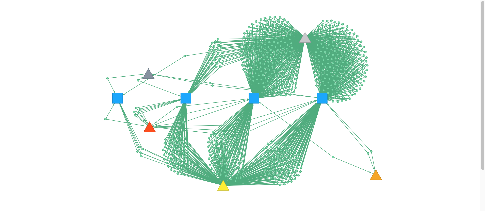

Panacea: Polarizing Attributes for Network Analysis of Correlation on Entities Association
-------



## Getting started

```bash
$ git clone https://github.com/6br/panacea
$ cd panacea
$ docker-compose build
$ docker-compose up
``` 

If it does not work,

```bash
$ docker-compose down
$ docker-compose up
```

If you need to rebuild,

```bash
$ docker-compose down
$ docker-compose build --no-cache
$ docker-compose up --force-recreate
```

Consider to check `~/.docker/config.json` when you struggle with proxies.

Access to `http://localhost:8080`

## Integrate with basic auth

```bash
$ htpasswd -c -b frontend/.htpasswd <user> <pass>
```

## Import Data

1. Modify the path on `analysis/complex_graph_all.sh`
2. Run `analysis/complex_graph_all.sh <csv_files_of_hr_data>`
3. Move the output to neo4j folder `mv analysis/graph_complex_all.neo.* neo4j/graph_complex_all.neo.*`
4. Run docker-compose `./docker-compose up`


## Citation

[Yokoyama TT, Okada M, Taniguchi, T. Visual Exploration System for Analyzing Trends in Annual Recruitment Using Time-varying Graphs. arXiv, arXiv:2008.10039, 2020.](https://arxiv.org/abs/2008.10039)
